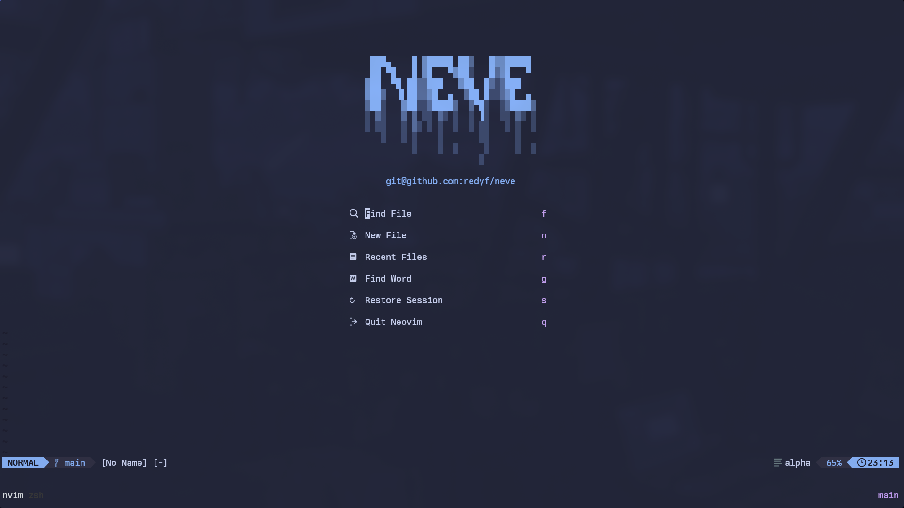
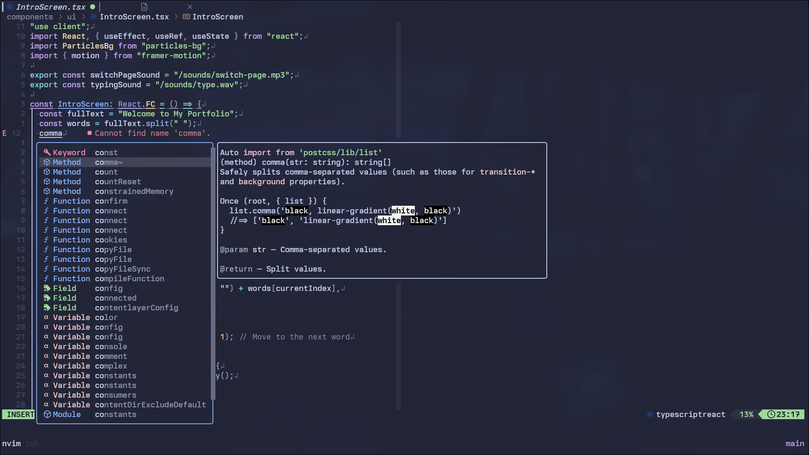
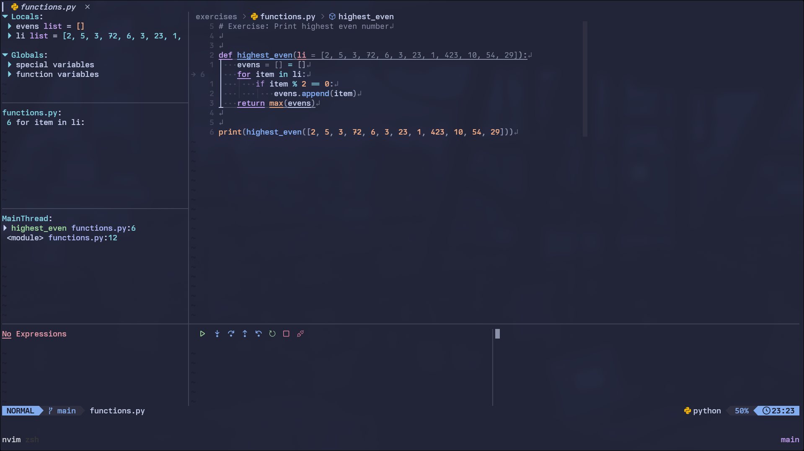
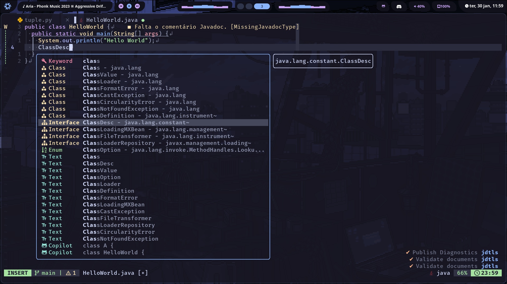

<h1 align="center">

   
   
  

    
    
    
    
     
            
    

   </h1>

<h1 align="center">❄️ Neve ❄️</h1>
<h3 align="center">

    
Showcase

</h3>

## What's Neve??

Neve (snow in portuguese) is a meticulously crafted custom configuration for Nixvim, designed to revolutionize your development workflow and provide an unparalleled coding experience. This configuration is the culmination of expertise and passion, aiming to provide sane defaults.

## Features

- **Powerful Development Environment:** Neve is tailored to deliver a robust and efficient development environment. With carefully selected plugins, optimized settings, and thoughtful customization, it ensures that your coding journey is both smooth and productive.

- **Nixvim Integration:** Built on the foundation of Nixvim, Neve seamlessly integrates with the powerful Nix package manager. This integration not only simplifies the setup process but also guarantees a consistent and reproducible development environment across different machines.

- **Thoughtful Customization:** Neve doesn't just stop at default settings. It's designed to be easily customizable, allowing you to tailor your Nixvim experience to match your unique preferences and workflow.

- **Extensive Plugin Support:** Benefit from a curated selection of plugins that cover a wide range of programming languages and development tasks. Neve comes with pre-configured plugins to boost your productivity, and you can effortlessly expand its capabilities to suit your specific needs.

## Installation

Getting started with Neve is a breeze. Simply follow the installation guide below, and you'll be up and running in no time.

However if you'd like to give it a try before installing, <b>nix run github:redyf/neve</b> is available!

    
<b>INSTALLATION GUIDE</b>

    I'm assuming you already use nix flakes but in case you don't, please check this tutorial to enable them:

[Flakes](https://nixos.wiki/wiki/Flakes)

After enabling it, follow the steps below:

1- Go to flake.nix and add Neve.url = "github:redyf/Neve" to your inputs.

2- Run nix flake update, then Neve should be available for installation.

3- Install it by adding `inputs.Neve.packages.${pkgs.system}.default` to your environment.systemPackages or home.packages if you're using home-manager.

4- Rebuild your system and you should be done :

## How to customize the install

If you would like to customize Neve to your liking, check this out!

1- Fork the repo (you can also change the name of the fork if you want).

2- Clone the fork.

3- Make the changes you want, such as enabling/disabling plugins, changing colorschemes, changing neovim options, etc.

4- Add the fork to your flake.nix file, the original is `Neve.url = “github:redyf/Neve”`. If a user called foo forks the repo and renames it to bar, it would be `bar.url = “github:foo/bar”`.

5- Update your inputs and install the fork with `inputs.Neve.packages.${pkgs.system}.default`.

6- Rebuild the system and you should be done!

## Quick Start

Neve is highly customizable. Here are some important files for configuring your environment:

- **config/default.nix:** This file contains the main configuration file. You can add or delete plugins as you like.

- **config/sets.nix:** In this file, you can add or remove options and adjust their specific settings.

- **config/keymaps.nix:** This file contains custom key mappings. You can add your own keyboard shortcuts to enhance productivity.

- **config/lsp/lsp.nix:** Here you can configure your preferred Language Servers.

- **config/lsp/conform.nix:** Configure Formatters for the desired languages.

- **config/languages/nvim-lint.nix:** Set up linters for specific languages.

## Contribution

Contributions are welcome! Feel free to [open an issue](https://github.com/redyf/Neve/issues) to report problems, suggest improvements, or submit pull requests to add new features to Neve.

## License

This project is licensed under the [MIT License](LICENCE). See the LICENSE file for more details.

## Support

Encountered an issue or have a question? Visit our [Issue Tracker](https://github.com/redyf/Neve/issues) or message me on Discord, my username is **redyf**.

Happy coding!
